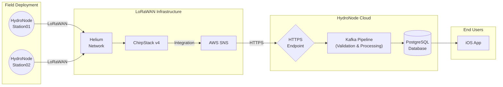

<div align="center">
  
  <h1>HydroNodeStation01</h1>
  <p><strong>Solar-powered, open-source LoRaWAN environmental monitoring node</strong></p>
  <p>Powered by <strong>HydroNode</strong></p>

  [](https://creativecommons.org/licenses/by-nc-sa/4.0/)
  [](https://www.st.com/en/microcontrollers-microprocessors/stm32wle5cc.html)
  [](https://lora-alliance.org/)
  [](https://hydronode.texhfexlabs.de/stations/public/004dd7e7-5c27-4de0-bff5-24116f721658)
</div>

---

> **Live now:** A station is deployed outdoors and streaming real sensor data —
> [view live dashboard](https://hydronode.texhfexlabs.de/stations/public/004dd7e7-5c27-4de0-bff5-24116f721658)

<div align="center">
  
</div>

---

## What Is This?

Detailed, hyperlocal environmental data is surprisingly scarce. Most weather and air quality stations are expensive, power-hungry, and installed only at a handful of official sites per city — leaving entire neighborhoods without meaningful data about what they breathe every day.

HydroNodeStation01 is a fully self-sufficient, unattended monitoring node that **anyone can reproduce** and deploy. It transmits CO₂, particulate matter, temperature, humidity, barometric pressure, and UV data over **LoRaWAN** using only a small solar panel and a single LiPo cell — and stays online for months without maintenance.

This is not a paper concept. It was designed, built, and field-tested as part of a university engineering project, with the goal of open, democratic, decentralized environmental monitoring.

---

## What It Measures

| Quantity | Sensor | Notes |
|---|---|---|
| CO₂ concentration | Sensirion **SCD41** | Single-shot photoacoustic NDIR, ±40 ppm |
| Particulate matter | Sensirion **SPS30** | PM1.0 / PM2.5 / PM4 / PM10 + number concentration |
| Temperature & Humidity | Sensirion **SHT45** | ±0.1 °C / ±1.0 % RH |
| Barometric pressure | Bosch **BMP390** | ±0.5 hPa absolute |
| UV index | Lite-On **LTR390** | UVA + ambient light |
| Battery state-of-charge | Maxim **MAX17048** | Fuel gauge via I2C |

All sensors share an I2C bus and are powered through load switches — the firmware cuts power completely to idle peripherals between transmissions. The platform is open to extension: any I2C-compatible sensor can be added with a firmware adaptation.

---

## Hardware

### Custom 4-Layer PCB

<div align="center">
  
</div>

The PCB was designed from scratch in **EasyEDA Pro**, fabricated at JLCPCB, and hand-assembled. It integrates:

- **STM32WLE5** — single-chip SoC with ARM Cortex-M4 + sub-GHz LoRa radio transceiver
- **BQ25185** — solar charger for harvesting from a small panel
- **TPS63900** — buck-boost converter, stable 3.3 V from 2.5 V to 4.2 V battery range
- **BGS12SN6** RF switch + **BALFHB-WL-02D3** balun — fully matched 868 MHz RF path
- All six sensors on a shared I2C bus with per-sensor power switching

Special attention was paid to RF layout: controlled-impedance traces, solid ground plane under the antenna feed, and proper keepout areas around the chip antenna.

> **Honest note on revision 1:** two issues were found on the first fabricated board and fixed in the corrected design:
> - **TPS63900 regulator** — a wiring bug in the regulator section. The station runs perfectly in the meantime with the same chip on a breakout adapter.
> - **BQ25185 charger `CE` pin** — must be driven by an MCU GPIO so the firmware can reset the charger's internal 6 h safety timeout (pulsed HIGH ~200 ms each cycle). The corrected design routes this; on the already-ordered boards the `CE` pin has to be hand-soldered to the GPIO.
>
> This is exactly the kind of real-world iteration documented openly so you don't repeat it.

### Stevenson Screen Enclosure

<div align="center">
  
</div>

The electronics live in a 3D-printed **Stevenson screen** in UV-resistant white **ASA** filament. Stacked louvers block direct sunlight and rain while allowing free air circulation — essential for accurate outdoor temperature and humidity readings. The design files (`.3mf`) are included and print on any consumer FDM printer.

### System Architecture



---

## Documentation

| Guide | Description |
|---|---|
| [Getting Started](doc/GETTING_STARTED.md) | Prerequisites, build, flash, first uplink, debug mode |
| [Configuration Reference](doc/CONFIGURATION.md) | LoRaWAN keys, feature flags, timing constants, payload format, decoder |

---

## Firmware

The firmware runs on the **STM32Cube ecosystem** with the Semtech LoRa Basics Modem (LBM). Every design decision prioritizes ultra-low power:

- **STOP2 deep sleep** between transmissions — all idle peripherals powered down
- **Single-shot sensor reads** — sensors powered down completely when not in use
- **3-minute measurement cycle** — wakes, reads all sensors, packs payload, transmits, sleeps
- **LoRaWAN Class A** with adaptive data rate (ADR) — SF7 by default to minimize on-air time
- **Staggered slow-sensor pre-wakeup** — slow sensors measure ahead of the TX window so the MCU never busy-waits:
    - **SCD41** runs two power-cycled single shots: a throw-away *stabilisation* shot starts **12 s** before the uplink, then the *useful* shot starts **6 s** before it (each ~5 s, settling during sleep). Only the second is transmitted.
    - **SPS30** starts its measurement **16.5 s** before the uplink (fan spin-up + settling).

**Power budget (measured, PPK2 on the custom PCB):** STOP2 idle current ~900 µA → ~46 days on a 1000 mAh LiPo without solar (~56 days on 1200 mAh). The datasheet floor from component sleep currents is ~5.7 µA; the gap is under investigation (suspected SCD41 IR leakage, BQ25185 quiescent, PCB leakage). Solar harvesting is designed to keep the node online indefinitely — long-term autonomy verification is ongoing.

### Build

All commands from `stm32_node/`:

```bash
# Configure (once)
cmake -B build/Release -DCMAKE_BUILD_TYPE=Release -DCMAKE_TOOLCHAIN_FILE=cmake/gcc-arm-none-eabi.cmake

# Build
cmake --build build/Release
```

ELF/binary output lands in `build/Release/`. Requires `arm-none-eabi-gcc`.

### Flashing LoRaWAN Keys

The **Device EUI is auto-derived from the STM32's 96-bit UID** — leave it at zero. On boot the firmware prints the derived Device EUI over SW-UART (PA6); register that EUI as an OTAA device (LoRaWAN 1.0.4, EU868) on your network server, then copy the resulting keys into `stm32_node/LoRaWAN/App/se-identity.h`:

```c
#define LORAWAN_DEVICE_EUI   00,00,00,00,00,00,00,00   // leave 00 — derived from chip UID
#define LORAWAN_JOIN_EUI     AA,BB,CC,DD,EE,FF,00,11   // from your network server
#define LORAWAN_APP_KEY      AA,BB,CC,...               // 16-byte app key from network server
#define LORAWAN_GEN_APP_KEY  AA,BB,CC,...               // same value as APP_KEY (LoRaWAN 1.0.x)
```

Supported network servers: **Helium IoT**, **ChirpStack v4**, **The Things Network**.

> `se-identity.h` is intentionally shipped with all-zero placeholder keys and is excluded from any sensitive commit.

### Downlink Commands

The node accepts LoRaWAN downlinks for remote control:

| Byte | Action |
|---|---|
| `0x11` | Trigger SPS30 fan cleaning |
| `0xFF` | Software reset |

The SPS30 also runs an automatic fan-cleaning cycle every 120 h (when battery > 4120 mV).

### Debug Profile Mode

Pull `DEBUG_SW_Pin` (PB4) HIGH before boot → the node reads all sensors in a tight loop and logs via software UART on PA6 (bit-banged, no LoRaWAN). Attach a USB-UART to PA6 to see live sensor values. Useful for sensor bring-up without waiting for TX windows.

---

## Repository Structure

```
hydroNodeStation01/
├── stm32_node/          # Firmware (STM32WLE5, CMake)
│   ├── Core/Src/        # Sensor drivers (SHT45, BMP390, LTR390, SCD41, SPS30, MAX17048)
│   ├── LoRaWAN/App/     # Application logic (lora_app.c), LoRaWAN keys (se-identity.h)
│   └── cmake/           # Toolchain files
├── hardware/
│   ├── ordered_pcb/     # Schematic PDF + PCB renders
│   ├── bom/             # Bill of materials
│   ├── CAD/             # Stevenson screen + enclosure (3MF + STEP)
│   └── datasheets/      # Key component datasheets
└── doc/
    ├── GETTING_STARTED.md  # Setup guide
    ├── CONFIGURATION.md    # All configuration reference
    ├── assets/             # Images and SVGs used in documentation
    └── analysis/           # Power budget analysis
```

---

## Reproduction Cost

The design is modular — not every sensor needs to be populated:

| Configuration | Approximate BOM Cost |
|---|---|
| Minimal (temp + humidity + pressure) | < $30 in sensors |
| Fully populated (all six sensors) | ~$120–150 |

---

## License

Hardware (schematic, PCB, CAD enclosure): **[CC BY-NC-SA 4.0](https://creativecommons.org/licenses/by-nc-sa/4.0/)**  
Firmware: **BSD-3-Clause** (STMicroelectronics/Semtech heritage) + custom application code

---

## Contributing & Community

Fork it, build it, deploy it, and contribute back. If you build a station, open an issue or PR — reports from real deployments (sensor calibration quirks, enclosure improvements, alternative sensors) are especially valuable.

Live data is flowing at **[hydronode.texhfexlabs.de](https://hydronode.texhfexlabs.de)**.
