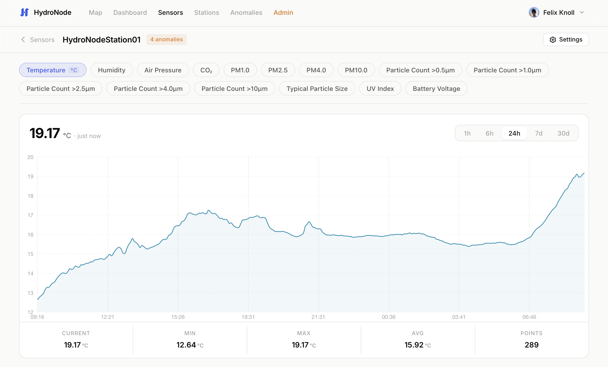
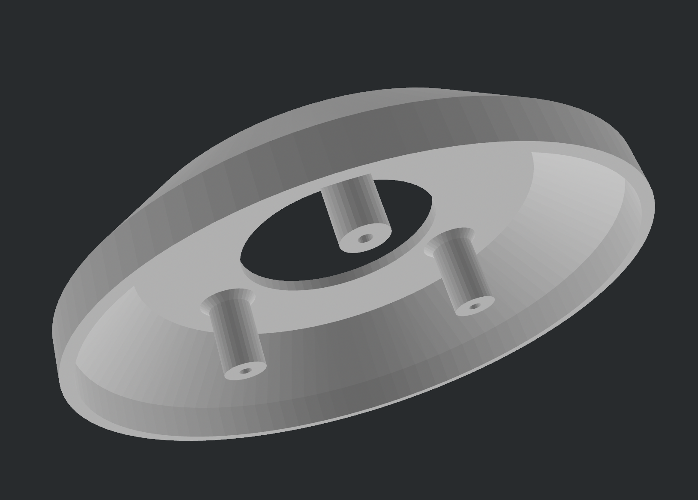
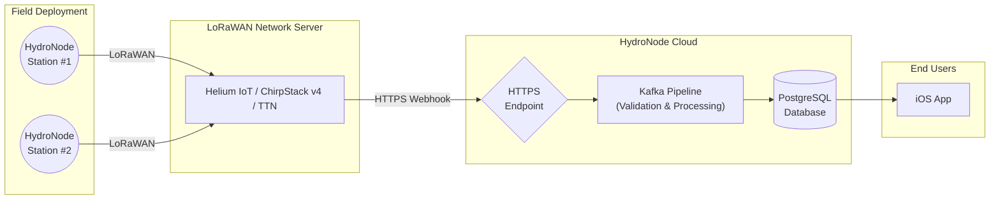

<div align="center">
  
  <h1>HydroNodeStation</h1>
  <p><strong>Solar-powered, open-source LoRaWAN environmental monitoring node</strong></p>
  <p>Powered by <strong>HydroNode</strong></p>

  [](LICENSE)
  [](LICENSES/MIT.txt)
  [](LICENSES/CC-BY-SA-4.0.txt)
  [](https://www.st.com/en/microcontrollers-microprocessors/stm32wle5cc.html)
  [](https://lora-alliance.org/)
  [](https://hydronode.texhfexlabs.de/stations/public/004dd7e7-5c27-4de0-bff5-24116f721658)
</div>

---

> **Live now:** A station is deployed outdoors and streaming real sensor data —
> [view live dashboard](https://hydronode.texhfexlabs.de/stations/public/004dd7e7-5c27-4de0-bff5-24116f721658)

<div align="center">
  
</div>

---

## What Is This?

Detailed, hyperlocal environmental data is surprisingly scarce. Most weather and air quality stations are expensive, power-hungry, and installed only at a handful of official sites per city — leaving entire neighborhoods without meaningful data about what they breathe every day.

HydroNodeStation is a self-sufficient, unattended monitoring node that **anyone can reproduce** and deploy. It transmits CO₂, particulate matter, temperature, humidity, barometric pressure, and UV data over **LoRaWAN** using a small solar panel and a single LiPo cell.

This is not a paper concept. It was designed, built, and field-tested as part of a university engineering project, with the goal of open, democratic, decentralized environmental monitoring.

**Project status:** hardware revision 2 pending fabrication, firmware 1.6 deployed, one station live in the field. Long-term solar autonomy verification is ongoing — see [Power Budget](#power-budget-measured) for measured numbers rather than estimates.

---

## Quick Links

| | |
|---|---|
| 🌐 **Live dashboard** | [hydronode.texhfexlabs.de](https://hydronode.texhfexlabs.de/stations/public/004dd7e7-5c27-4de0-bff5-24116f721658) |
| 🔧 **Hardware design (EasyEDA Pro / OSHWLab)** | [oshwlab.com/knollfelix004/project_fegzdygg](https://oshwlab.com/knollfelix004/project_fegzdygg) |
| 🚀 **Build & flash** | [doc/GETTING_STARTED.md](doc/GETTING_STARTED.md) |
| ⚙️ **Configuration reference** | [doc/CONFIGURATION.md](doc/CONFIGURATION.md) |
| 🛡️ **Reliability & rollout notes** | [doc/RELIABILITY.md](doc/RELIABILITY.md) |
| ⚖️ **Licensing** | [LICENSING.md](LICENSING.md) |
| 📜 **Development history** | [doc/DEVELOPMENT_HISTORY.md](doc/DEVELOPMENT_HISTORY.md) |

---

## What It Measures

| Quantity | Sensor | Notes |
|---|---|---|
| CO₂ concentration | Sensirion **SCD41** | Single-shot photoacoustic NDIR, ±40 ppm |
| Particulate matter | Sensirion **SPS30** | PM1.0 / PM2.5 / PM4 / PM10 + number concentration |
| Temperature & Humidity | Sensirion **SHT45** | ±0.1 °C / ±1.0 % RH |
| Barometric pressure | Bosch **BMP390** | ±0.5 hPa absolute |
| UV index | Lite-On **LTR390** | UVA + ambient light |
| Battery state-of-charge | Maxim **MAX17048** | Fuel gauge via I2C |

All sensors share an I2C bus. Drivers request sensor sleep/power-down between measurements; physical power isolation depends on the PCB wiring. The platform is open to extension: any I2C-compatible sensor can be added with a firmware adaptation.

---

## Hardware

### Custom 4-Layer PCB

<div align="center">
  
</div>

The PCB was designed from scratch in **EasyEDA Pro**, fabricated at JLCPCB, and hand-assembled. It integrates:

- **STM32WLE5** — single-chip SoC with ARM Cortex-M4 + sub-GHz LoRa radio transceiver
- **BQ25185** — solar charger for harvesting from a small panel
- **TPS63900** — buck-boost converter, stable 3.3 V from 2.5 V to 4.2 V battery range
- **BGS12SN6** RF switch + **BALFHB-WL-02D3** balun — fully matched 868 MHz RF path
- All six sensors on a shared I2C bus with per-sensor power switching

Special attention was paid to RF layout: controlled-impedance traces, solid ground plane under the antenna feed, and proper keepout areas around the chip antenna.

> **Honest note on revision 1:** two issues were found on the first fabricated board and fixed in the corrected design:
> - **TPS63900 regulator** — a wiring bug in the regulator section. The station runs perfectly in the meantime with the same chip on a breakout adapter.
> - **BQ25185 charger `CE` pin** — must be driven by an MCU GPIO so the firmware can reset the charger's internal 6 h safety timeout (pulsed HIGH ~200 ms each cycle). The corrected design routes this; on the already-ordered boards the `CE` pin has to be hand-soldered to the GPIO.
>
> This is exactly the kind of real-world iteration documented openly so you don't repeat it.

### Stevenson Screen Enclosure

<div align="center">
  
</div>

The electronics live in a 3D-printed **Stevenson screen** in UV-resistant white **ASA** filament. Stacked louvers block direct sunlight and rain while allowing free air circulation — essential for accurate outdoor temperature and humidity readings. The design files (`.3mf`) are in [`hardware/CAD/`](hardware/CAD/) and print on any consumer FDM printer.

> **UV window caveat:** the LTR390 needs protection while still seeing UV. Ordinary glass and PETG block much of the UV band and falsify the reading. UV-transparent quartz or borosilicate runs ~€50 including shipping; cheaper UV-A/UV-B-transparent films are still under test. Budget for the window material if you reproduce this.

### System Architecture



---

## Firmware

**Firmware 1.6:** fixes the reproducible 49.71-day uplink alarm overflow and adds watchdog/progress recovery, robust sensor shutdown, battery recovery and transactional NVM. See [reliability and rollout notes](doc/RELIABILITY.md). No percentage energy reduction has been measured for this update.

The firmware runs on the **STM32Cube ecosystem** with the Semtech **LoRa Basics Modem (LBM)**. Every design decision prioritizes low power:

- **STOP2 deep sleep** between transmissions — idle peripherals powered down
- **Single-shot sensor reads** — sensors commanded to sleep when not in use
- **3-minute measurement cycle** (`APP_TX_DUTYCYCLE`, remotely adjustable 30–3600 s)
- **LoRaWAN Class A** with adaptive data rate (ADR) — SF7 by default to minimize on-air time
- **Staggered slow-sensor pre-wakeup** — slow sensors measure ahead of the TX window so the MCU never busy-waits:
    - **SCD41** runs two power-cycled single shots: a throw-away *stabilisation* shot starts **12 s** before the uplink, then the *useful* shot starts **6 s** before it (each ~5 s, settling during sleep). Only the second is transmitted.
    - **SPS30** starts its measurement **16.5 s** before the uplink (fan spin-up + settling).

### Power Budget (measured)

These are **PPK2 measurements on the custom PCB**, not datasheet arithmetic.

Day-average baseline draw is **~1.1 mA**. The datasheet floor from component sleep currents is **~5.7 µA**; the gap is under active investigation (suspected SCD41 IR leakage, BQ25185 quiescent current, PCB leakage). Including transmit events the time-averaged draw is **~2.12 mA** → **~24 days on a 1200 mAh LiPo without any solar input**. Solar harvesting is designed to keep the node online indefinitely; long-term autonomy verification is ongoing.

**Measured daily consumption:** baseline plus extra charge per transmit event sums to **~50.9 mAh/day** (~183,408 mC/day). At 1200 mAh that is `1200 / 50.9 ≈ 24 days`.

| Source | Interval | Extra charge/event | Events/day | mC/day |
|---|---|---|---|---|
| Baseline (1.1 mA × 86400 s) | — | — | — | 95,040 |
| LoRa TX (+0.7 mA × 10 s) | 3 min | 7 mC | 480 | 3,360 |
| SCD41 CO₂ (+77 mC) | 15 min | 77 mC | 96 | 7,392 |
| SPS30 (55 mA × 30 s − idle) | 30 min | ~1,617 mC | 48 | 77,616 |
| **Total** | | | | **~183,408** |

`183,408 mC / 3600 = ~50.9 mAh/day`

> Closing the 1.1 mA → 5.7 µA gap is the single highest-impact open task on this project. If you have experience hunting leakage on STM32WL designs, [issues are open](../../issues).

### Build

All commands from `stm32_node/`:

```bash
cmake -B build/Release -DCMAKE_BUILD_TYPE=Release -DCMAKE_TOOLCHAIN_FILE=cmake/gcc-arm-none-eabi.cmake
cmake --build build/Release
```

ELF/binary output lands in `build/Release/`. Requires `arm-none-eabi-gcc`.

### Flashing LoRaWAN Keys

The **Device EUI is auto-derived from the STM32's 96-bit UID** — leave it at zero. On boot the firmware prints the derived Device EUI over SW-UART (PA6); register that EUI as an OTAA device (LoRaWAN 1.0.4, EU868) on your network server, then put the resulting key macros in the Git-ignored `stm32_node/LoRaWAN/App/se-identity-local.h`:

```c
#define LORAWAN_DEVICE_EUI   00,00,00,00,00,00,00,00   // leave 00 — derived from chip UID
#define LORAWAN_JOIN_EUI     AA,BB,CC,DD,EE,FF,00,11   // from your network server
#define LORAWAN_APP_KEY      AA,BB,CC,...               // 16-byte app key from network server
#define LORAWAN_GEN_APP_KEY  AA,BB,CC,...               // same value as APP_KEY (LoRaWAN 1.0.x)
```

Supported network servers: **Helium IoT**, **ChirpStack v4**, **The Things Network**.

> ⚠️ `se-identity.h` is tracked and contains **zeros only**. Production keys belong exclusively in the git-ignored `se-identity-local.h`. Never commit real keys — see [SECURITY.md](SECURITY.md).

### Downlink Commands

The node accepts LoRaWAN downlinks (fPort matching the command port) for remote control:

| Bytes | Action |
|---|---|
| `0x10 HH LL` | Set TX interval to `HHLL` seconds (2-byte big-endian, range 30–3600 s, persisted to flash). E.g. `10 00 B4` = 180 s. Handy for testing without re-flashing. |
| `0x11` | Trigger SPS30 fan cleaning |
| `0x12` | Request boot/reset/sensor diagnostics on fPort 5 |
| `0xFF` | Software reset |

The SPS30 also runs an automatic fan-cleaning cycle every 120 h (when battery > 4120 mV).

### Debug Profile Mode

With `APP_LOG_ENABLED=1`, pull `DEBUG_SW_Pin` (PB4) HIGH before boot → the node reads all sensors in a tight loop and logs via software UART on PA6 (bit-banged, no LoRaWAN). Attach a USB-UART to PA6 to see live sensor values. Useful for sensor bring-up without waiting for TX windows.

---

## Reproduce It

1. **Fork the hardware** on [OSHWLab](https://oshwlab.com/knollfelix004/project_fegzdygg) — opens directly in EasyEDA Pro, no desktop EDA install needed.
2. **Order the PCB** from JLCPCB straight out of the editor. 4 layers, standard process.
3. **Order the parts** — BOM with LCSC part numbers in [`hardware/bom/`](hardware/bom/). Populate only the sensors you need.
4. **Print the enclosure** — [`hardware/CAD/`](hardware/CAD/), `.3mf`, **ASA** not PLA.
5. **Build and flash** the firmware — see [Getting Started](doc/GETTING_STARTED.md).
6. **Join a LoRaWAN network** and point the integration at your backend. The payload decoder is in [`doc/payload-decoder.js`](doc/payload-decoder.js).

### Reproduction Cost

The design is modular — not every sensor needs to be populated:

| Configuration | Approximate BOM Cost |
|---|---|
| Minimal (temp + humidity + pressure) | < $30 in sensors |
| Air quality (+ UV, + CO₂) | ~$70 in sensors |
| Fully populated (all six sensors) | ~$120–150 |

---

## Repository Structure

```
hydroNodeStation/
├── stm32_node/          # Firmware (STM32WLE5, CMake, LoRa Basics Modem)
│   ├── Core/Src/        # Own sensor drivers (SHT45, BMP390, LTR390, SCD41, SPS30, MAX17048, BQ25185)
│   ├── LoRaWAN/App/     # Application logic (lora_app.c), key template (se-identity.h)
│   ├── tests/           # Host-side regression tests
│   └── cmake/           # Toolchain files
├── hardware/
│   ├── ordered_pcb/     # Schematic PDF + PCB renders as fabricated
│   ├── schematics_pcb/  # Schematic and PCB exports
│   ├── bom/             # Bill of materials (LCSC part numbers)
│   ├── CAD/             # Stevenson screen + PCB enclosure (.3mf)
│   └── datasheets/      # Component datasheets (vendor copyright, see LICENSING.md)
├── doc/
│   ├── GETTING_STARTED.md          # Setup guide
│   ├── CONFIGURATION.md            # Configuration reference
│   ├── RELIABILITY.md              # Firmware 1.6 reliability + rollout notes
│   ├── payload-decoder.js          # LoRaWAN payload decoder
│   ├── DEVELOPMENT_HISTORY.md      # Issue/PR record from the private development phase
│   ├── open-source-documentation/  # OSHWLab project description
│   ├── study-documentation/        # Full project report (German)
│   ├── zwischenbericht/            # Interim report (German)
│   ├── presentations/              # Project pitch decks
│   ├── assets/                     # Images and SVGs used in documentation
│   └── analysis/                   # Power budget analysis
└── LICENSES/            # Full licence texts
```

---

## Contributing

Contributions are welcome — this design only gets better with more deployments behind it.

**Especially valuable:**

- **Field reports.** If you build a station, open an issue with your location, sensor configuration, and what broke. Real deployment data is worth more than code.
- **The 1.1 mA leakage hunt** (see [Power Budget](#power-budget-measured)) — the highest-impact open problem.
- **Sensor drivers** for additional I2C devices.
- **UV-transparent window materials** that cost less than €50.
- **Enclosure improvements** — better sealing, easier printing, alternative mounts.

**How:**

1. Open an issue first for anything non-trivial, so we can agree on the approach.
2. Fork, branch, and keep commits focused. Firmware changes should build both `Debug` and `Release` targets.
3. Host-side tests live in `stm32_node/tests/` — add one where it makes sense.
4. By contributing you agree your contribution is licensed under the terms in [LICENSING.md](LICENSING.md) for the part of the tree you touched.

Issues labelled [`good first issue`](../../issues?q=is%3Aissue+is%3Aopen+label%3A%22good+first+issue%22) and [`help wanted`](../../issues?q=is%3Aissue+is%3Aopen+label%3A%22help+wanted%22) are the easiest way in.

---

## Security

Never commit real LoRaWAN keys. See [SECURITY.md](SECURITY.md) for how to report a vulnerability and how key material is handled in this repository.

---

## License

This is a mixed hardware/software project with three licences. Full details and the file-level map are in **[LICENSING.md](LICENSING.md)**.

| Part | Licence |
|---|---|
| Hardware — schematic, PCB, CAD, BOM | **[CERN-OHL-S v2](LICENSE)** (strongly reciprocal) |
| Documentation & media | **[CC BY-SA 4.0](LICENSES/CC-BY-SA-4.0.txt)** |
| Firmware — own code | **[MIT](LICENSES/MIT.txt)** |
| Firmware — ST / Arm / Semtech components | unchanged upstream terms (BSD-3-Clause, Apache-2.0) |

No non-commercial restriction. You may build, modify, and sell this design — hardware modifications must be shared back under the same licence.

---

## Built With

Designed in **[EasyEDA Pro](https://easyeda.com/)**, fabricated at **[JLCPCB](https://jlcpcb.com/)**, and shared on **[OSHWLab](https://oshwlab.com/knollfelix004/project_fegzdygg)** — the complete 4-layer board including the RF section was designed in a browser, ordered from the editor, and published so anyone can fork it.

---

<div align="center">
  <strong>Build it. Deploy it. Fork it. Join the network.</strong><br>
  Live data at <a href="https://hydronode.texhfexlabs.de">hydronode.texhfexlabs.de</a>
</div>
