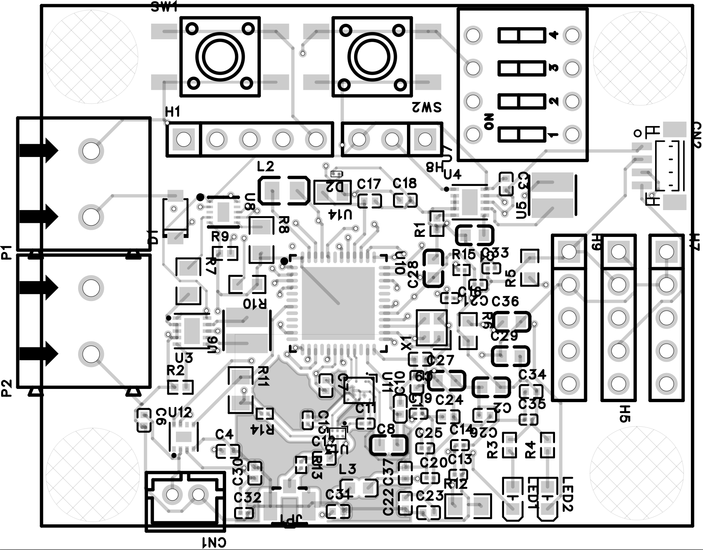
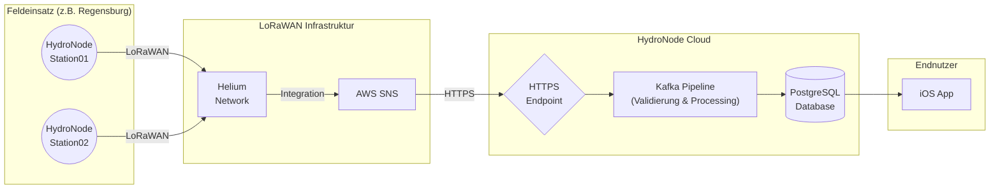

# HydroNodeStation01

Eine autarke, hocheffiziente Wetterstation, konzipiert für das HydroNode-Netzwerk. Das Projekt demonstriert, wie mit minimalem Energiebedarf, einer kleinen Batterie und einem kompakten Solarpanel eine Vielzahl präziser Umweltdaten erfasst und per LoRaWAN übermittelt werden kann. Ziel ist der flächendeckende Einsatz (z.B. im Raum Regensburg), um öffentlich zugängliche Echtzeit-Wetterdaten und weitreichende Analysen bereitzustellen.

## Systemarchitektur

Das System ist in drei Hauptbereiche unterteilt: Hardware, Software (STM32 Node) und Mechanik (CAD).



### Hardware & Sensoren
Die Elektronik ist auf maximale Effizienz und Kompaktheit ausgelegt. Das Custom-PCB bündelt fortschrittliche Sensorik und ein intelligentes Power-Management:
* **Mikrocontroller & Funk:** STM32WLE5 (integriertes LoRaWAN)
* **Power Management:** TPS63900 (Buck-Boost) und MAX17048 (Batterie-IC) für Solar- und Batteriebetrieb
* **Klima & Luftgüte:** Sensirion SCD41 (CO2), SPS30 (Feinstaub), SHT45 (Temperatur/Luftfeuchtigkeit)
* **Wetter & Licht:** Bosch BMP390 (Luftdruck), LTR390 (UV/Umgebungslicht)



### Software (STM32 Node)
Die Firmware basiert auf dem STM32Cube-Ökosystem und implementiert einen LoRaWAN End-Node. Der Fokus der Entwicklung liegt auf tiefgreifender Energieoptimierung:
* Nutzung des STOP2-Modus für minimalen Ruhestrom
* Effizientes Sensor-Auslesen durch präzises Timing
* Übertragung komprimierter Payloads über das LoRa-Netzwerk

### Mechanik (CAD)
Die Elektronik wird in einem speziell entwickelten Gehäuse (Stevenson Screen) untergebracht. Dieses schützt die Komponenten vor Witterungseinflüssen, während es gleichzeitig eine optimale Luftzirkulation für exakte Messwerte gewährleistet.


## Projektphasen

Das Projekt durchläuft vier klar definierte Phasen. Derzeit befinden wir uns am Übergang zur Fertigung und Gehäuseentwicklung.

**1. Hardware & Software (Aktuell)**
Die Hardware-Entwicklung ist abgeschlossen. Das finale PCB wird derzeit bei JLCPCB gefertigt und bestückt. Parallel wird die Firmware auf den neuen STM32-Chip portiert und finalisiert.

**2. Gehäuse-Design (Demnächst)**
Sobald die Hardware vorliegt, startet die CAD-Konstruktion für ein kompaktes und ästhetisches Gehäuse.

**3. Feldtests (Geplant)**
Die fertigen Prototypen werden an verschiedenen Standorten installiert. Hier werden Zuverlässigkeit, Energieverbrauch und Sensorpräzision unter realen Bedingungen validiert.

**4. HydroNode Integration (Geplant)**
Die Stationen werden vollständig in das HydroNode-Netzwerk integriert. Die gesammelten Daten fließen in ein Backend zur tiefgehenden Analyse und werden für Endnutzer visuell aufbereitet.

## System-Integration



## Build & Entwicklung

Die Firmware unterstützt zwei verschiedene Hardware-Targets über CMake-Build-Profile. Die Unterscheidung erfolgt über den `CMAKE_BUILD_TYPE`.

### Targets

*   **Release (STM32WLE5xx):** Target für das finale **Custom-PCB**. 
    *   Nutzt das angepasste Pin-Mapping für das UFQFPN48 Gehäuse.
    *   Verwendet die neue 1-Pin Radio-Switch-Logik (BGS12SN6 an PC13).
    *   Optimiert auf Größe (`-Os`).
*   **Debug (STM32WL55xx):** Target für das **Entwicklungs-Board / Wio-E5 mini**. 
    *   Nutzt das Standard-Pin-Mapping des WL55 (UFBGA73).
    *   Verwendet die 2-Pin Radio-Switch-Logik (PA4/PA5).
    *   Enthält Debug-Symbole und deaktiviert Optimierungen (`-O0 -g3`).

### Build-Befehle

Befehle müssen im Verzeichnis `stm32_node` ausgeführt werden.

#### Für das neue Custom-Board (Release)
```bash
# Konfigurieren
cmake -B build/Release -DCMAKE_BUILD_TYPE=Release -DCMAKE_TOOLCHAIN_FILE=cmake/gcc-arm-none-eabi.cmake

# Bauen
cmake --build build/Release
```

#### Für das Wio-E5 / WL55 Dev-Board (Debug)
```bash
# Konfigurieren
cmake -B build/Debug -DCMAKE_BUILD_TYPE=Debug -DCMAKE_TOOLCHAIN_FILE=cmake/gcc-arm-none-eabi.cmake

# Bauen
cmake --build build/Debug
```