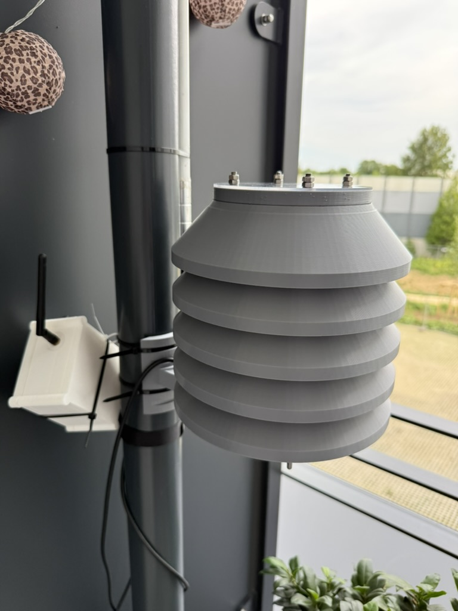
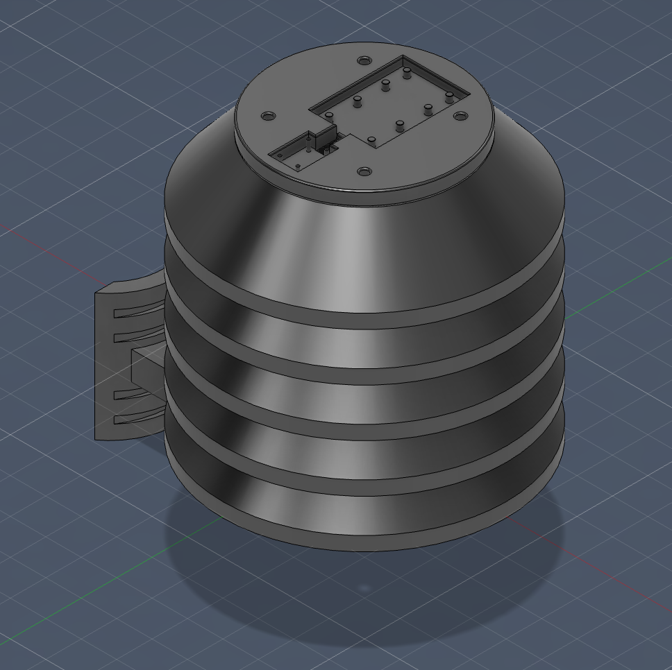
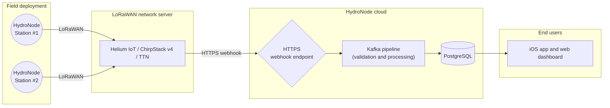
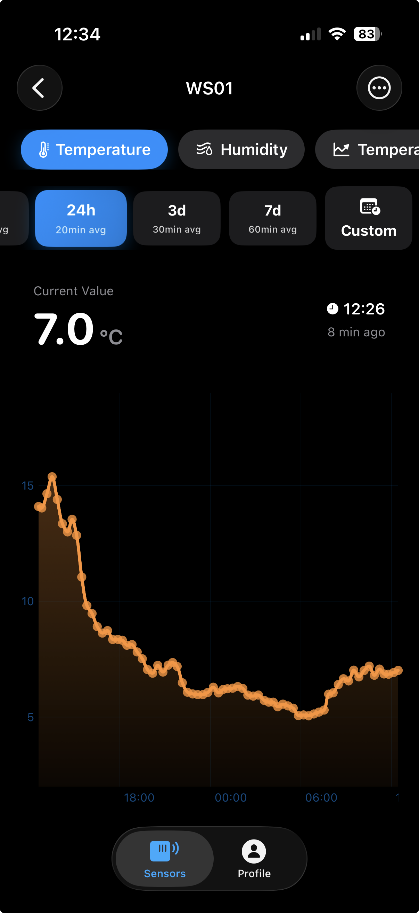
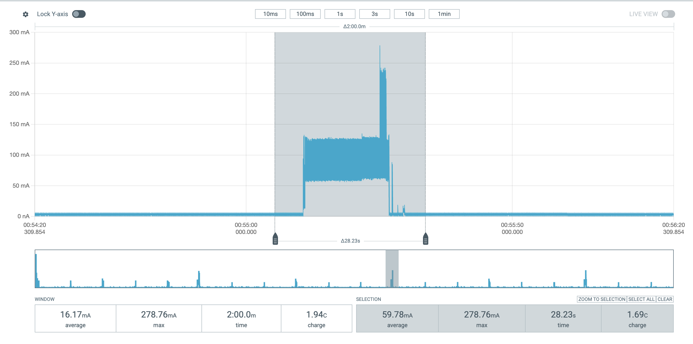

<div align="center">
  
  <h1>HydroNodeStation</h1>
  <p><strong>Solar-powered, open-source LoRaWAN environmental monitoring node</strong></p>
  <p>Powered by <strong>HydroNode</strong></p>

  [](https://github.com/TexhFexLabs/HydroNodeStation/actions/workflows/build.yml)
  [](LICENSE)
  [](LICENSES/MIT.txt)
  [](LICENSES/CC-BY-SA-4.0.txt)
  [](https://www.st.com/en/microcontrollers-microprocessors/stm32wle5cc.html)
  [](https://lora-alliance.org/)
  [](https://hydronode.tech/stations/public/004dd7e7-5c27-4de0-bff5-24116f721658)
</div>

---

> **Live now.** A station is deployed outdoors and streaming real sensor data.
> [View the live dashboard.](https://hydronode.tech/stations/public/004dd7e7-5c27-4de0-bff5-24116f721658)

<div align="center">
  
</div>

---

## What this is

Hyperlocal environmental data is scarce. Most weather and air quality stations are expensive, need mains power, and are installed at only a handful of official sites per city. Whole neighbourhoods have no measurements of the air they breathe.

The limiting factor is not the sensors. It is power and connectivity. A station that needs mains power or Wi-Fi can only go where that infrastructure already exists, which is not where the data gaps are.

HydroNodeStation is a monitoring node that needs no mains power, no Wi-Fi and no cellular contract. It runs on a small solar panel and a single LiPo cell, transmits over LoRaWAN, and is designed to be reproduced by anyone with a JLCPCB account and a 3D printer.

It is not a paper design. It was built, assembled and deployed as part of a university engineering project, and one station has been reporting continuously.

**Project status:** hardware revision 2 is pending fabrication, firmware 1.6 is deployed, one station is live in the field. Long-term solar autonomy through a winter is not verified yet. See [Power budget](#power-budget-measured) for measured numbers instead of estimates.

<div align="center">
  
  <br><em>The deployed station.</em>
</div>

---

## Quick links

| | |
|---|---|
| Live dashboard | [hydronode.tech](https://hydronode.tech/stations/public/004dd7e7-5c27-4de0-bff5-24116f721658) |
| Hardware design (EasyEDA Pro / OSHWLab) | [oshwlab.com/knollfelix004/project_fegzdygg](https://oshwlab.com/knollfelix004/project_fegzdygg) |
| Build a station | [Jump to the build guide](#build-a-station) |
| Firmware reference | [doc/GETTING_STARTED.md](doc/GETTING_STARTED.md) |
| Configuration reference | [doc/CONFIGURATION.md](doc/CONFIGURATION.md) |
| Reliability and rollout notes | [doc/RELIABILITY.md](doc/RELIABILITY.md) |
| Licensing | [LICENSING.md](LICENSING.md) |
| Development history | [doc/DEVELOPMENT_HISTORY.md](doc/DEVELOPMENT_HISTORY.md) |

---

## What it measures

| Quantity | Sensor | I2C address | Notes |
|---|---|---|---|
| CO2 concentration | Sensirion **SCD41** | 0x62 | Single-shot photoacoustic NDIR, plus or minus 40 ppm |
| Particulate matter | Sensirion **SPS30** | 0x69 | PM1.0, PM2.5, PM4, PM10 and number concentration |
| Temperature and humidity | Sensirion **SHT45** | 0x44 | plus or minus 0.1 degrees C, plus or minus 1.0 percent RH |
| Barometric pressure | Bosch **BMP390** | 0x77 | plus or minus 0.5 hPa absolute |
| UV index | Lite-On **LTR390** | 0x53 | UVA and ambient light |
| Battery state of charge | Maxim **MAX17048** | 0x36 | Fuel gauge, no sense resistor needed |

All six share one I2C bus. Sensors are commanded into their own sleep states between measurements. The SPS30 sits on a separate 5 V rail that the firmware switches off entirely through a GPIO.

The sensor set is a starting point, not a limit. Any I2C sensor can be added with a firmware adaptation.

---

## Hardware

### Custom 4-layer PCB

<div align="center">
  
</div>

Designed from scratch in EasyEDA Pro, fabricated and assembled at JLCPCB.

| Function | Part |
|---|---|
| MCU and radio | **STM32WLE5CCU6**, Cortex-M4 at 48 MHz with an integrated sub-GHz LoRa transceiver |
| RF front end | **BALFHB-WL-02D3** balun and **BGS12SN6** TX/RX switch on GPIO PC13 |
| Antenna | External SMA connector |
| Solar charger | **BQ25185** |
| Regulators | Two **TPS63900** buck-boost converters. 3.3 V primary always on, 5 V secondary switched by GPIO for the SPS30 |
| Fuel gauge | **MAX17048** |

**Stackup.** Top and bottom carry signal and supply. Inner 1 is a dedicated ground layer with a continuous copper pour. Inner 2 is a second signal layer. The continuous ground layer gives short return paths and keeps common-mode noise off the I2C and control lines.

**RF layout.** Traces in the RF section are 50 ohm controlled impedance for 868 MHz. A dense ground via fence surrounds the balun, the switch, the decoupling capacitors and the SMA path. It ties the RF field down to the ground layer and suppresses coupling into the rest of the board.

**Connectors.** A 2-pin JST connector and a parallel screw terminal for the battery, a 2-pin screw terminal for the solar panel, a 6-pin screw terminal for the cable to the Stevenson screen (I2C, supply, panel lead), and a 4-pin header for the ST-Link V2 (NRST, SWDCLK, SWDIO, GND). Test pads are provided on the supply rails, the I2C bus and the charger CE pin.

> **Two faults in revision 1, both fixed in the published design.**
>
> **TPS63900 regulator section.** A wiring mistake. The deployed station runs the same chip on a breakout board plugged into the PCB headers as a workaround.
>
> **BQ25185 CE pin.** It has to be driven by an MCU GPIO so the firmware can reset the charger's internal 6 hour safety timeout. Without that, charging stops silently after six hours, which is fatal on a solar node. Revision 2 routes CE to a GPIO that the firmware pulses. On boards already fabricated, this pin has to be hand-soldered to the GPIO.

### Stevenson screen enclosure

<div align="center">
  
  
  <br><em>Printed part and the CAD model it comes from. The plate on top carries the PCB.</em>
</div>

Designed in Fusion 360, printed in white ASA. Stacked louvers block direct sun and driving rain while air circulates freely. Without that the housing heats up in sunlight and the temperature and humidity readings are wrong. ASA was chosen over PLA and PETG for outdoor UV stability. A PLA enclosure becomes brittle within a season.

Both models are in [`hardware/CAD/`](hardware/CAD/) as `.3mf` and print on any consumer FDM printer.

### System architecture



---

## Build a station

This is the complete path from ordering parts to seeing your own readings on the dashboard. Budget two to three weeks, most of which is PCB lead time.

### Step 0: pick a path

| Path | What you get |
|---|---|
| **Custom PCB** (recommended) | The real thing. Order and assemble at JLCPCB straight from the EasyEDA project. Roughly 200 EUR for 5 assembled boards including shipping, 2 to 3 weeks lead time. |
| **Seeed Studio Wio-E5 mini** (prototyping) | A development board with an STM32WL55JC and pin headers. No soldering iron needed. Sensors attach as breakout boards over jumper wires on the same I2C bus the custom PCB uses. Good for trying the firmware before committing to a board order. |

For the Wio-E5 path you also need breakout boards for the SHT45, BMP390 and LTR390 (Adafruit), the SCD41 (Seeed Studio) and the SPS30 (Sensirion), a MAX17048 breakout, jumper wires, and a step-up converter to 5 V for the SPS30.

### Step 1: order the PCB

1. Open the [OSHWLab project](https://oshwlab.com/knollfelix004/project_fegzdygg) and fork it. It opens in EasyEDA Pro in the browser, so no desktop EDA installation is needed.
2. Order from the editor through JLCPCB. 4 layers, standard process, no exotic requirements.
3. Enable SMT assembly. This matters. The STM32WLE5, the balun and the RF switch are fine-pitch parts, and hand-soldering them is where most reproduction attempts fail.
4. The bill of materials with LCSC part numbers is generated by EasyEDA on the project page and can be ordered from there directly. Populate only the sensors you need, see the cost table below.

### Step 2: order the remaining parts

These are not on the PCB and have to be sourced separately.

| Part | What is deployed today | Notes |
|---|---|---|
| Solar panel | **AnySolar SOLAR CELL G3 THIN**, 6.91 V, 570.8 mW, Vmpp 5.58 V, Impp 102 mA | Fully sufficient in summer. Winter operation is not verified yet. **Do not use a smaller panel.** Same size or larger only. |
| Battery | 1S LiPo, **1200 mAh** | Scale with the panel. Larger is fine and helps in winter. Much smaller is risky, since several overcast days in a row will drain it. |
| Antenna | 868 MHz antenna with an SMA connector | The board has an external SMA connector, so any matched antenna works. |
| Cable to the screen | 6-core cable | Runs from the PCB screw terminal to the sensor head: I2C, supply, panel lead. |
| Cable gland | Waterproof, sized for your cable | For the panel lead entering the enclosure. |
| UV window | 2 mm polystyrene sheet | See the note below. |
| Programmer | ST-Link V2 | Connects to NRST, SWDCLK, SWDIO, GND. |
| Serial adapter | USB to UART, 3.3 V | Needed once, to read the Device EUI off PA6 at 115200 baud. |

> **About the UV window.** The LTR390 has to see UV through the enclosure, but ordinary glass and PETG block most of it and produce a reading that is wrong rather than missing. The deployed station uses roughly 2 mm of polystyrene with an empirical correction factor of 17/13, applied in the firmware as integer arithmetic. That was a cost decision. It works, but polystyrene is not UV-stable and will degrade outdoors. **UV-transmitting acrylic (PMMA UVT) is the better choice** for a station meant to last. Quartz or borosilicate is better still and costs around 50 EUR for a small disc. Issue [#2](../../issues/2) tracks cheaper options.

### Step 3: print the enclosure

Both models are in [`hardware/CAD/`](hardware/CAD/).

- `hydroNodeStation_outdoor_screen.3mf` is the Stevenson screen for the sensor head.
- `hydroNodeStation_outdoor_box.3mf` is the housing for the PCB.

Print in **white ASA**, not PLA and not PETG. White reflects sunlight, which matters for the temperature reading, and ASA survives UV exposure. Expect to iterate once on fit. The original design took several print runs to get right.

### Step 4: assemble

1. Mount the PCB on the plate at the top of the Stevenson screen.
2. Wire the 6-core cable from the PCB screw terminal to the sensor head.
3. Connect the battery to the JST connector or the parallel screw terminal.
4. Connect the solar panel to its screw terminal, routing the lead through the cable gland.
5. Screw the antenna onto the SMA connector.
6. Fit the UV window over the LTR390.

> **Building from revision 1 boards?** Hand-solder the BQ25185 CE pin to the MCU GPIO before you deploy. Without it, charging stops after six hours and the station dies over a few days while sitting in full sun.

> **Battery protection.** In the published schematic the BQ25185 TS/MR pin uses a fixed 10 kilohm resistor, so the charger does not measure battery temperature. Outdoor winter operation needs an appropriate battery NTC and a verified undervoltage path. The firmware cannot protect an unprotected cell below MCU operating voltage. See [doc/RELIABILITY.md](doc/RELIABILITY.md).

### Step 5: install the toolchain

| Tool | Version |
|---|---|
| `arm-none-eabi-gcc` | 12 or newer |
| `cmake` | 3.22 or newer |
| `ninja` | any |
| `openocd` or STM32CubeProgrammer | any |

```bash
# macOS
brew install arm-none-eabi-gcc cmake ninja

# Ubuntu / Debian
sudo apt install gcc-arm-none-eabi cmake ninja-build
```

### Step 6: build the firmware

```bash
git clone https://github.com/TexhFexLabs/HydroNodeStation.git
cd HydroNodeStation/stm32_node

cmake -B build/Release -DCMAKE_BUILD_TYPE=Release -DCMAKE_TOOLCHAIN_FILE=cmake/gcc-arm-none-eabi.cmake
cmake --build build/Release
```

The output is `build/Release/LoRaWAN_End_Node_LBM.elf` plus `.bin` and `.hex`. For the Wio-E5 mini, use the `Debug` target instead.

Leave the LoRaWAN keys alone for now. `LORAWAN_DEVICE_EUI` stays at all zeros, which tells the firmware to derive the Device EUI from the STM32 hardware UID.

### Step 7: flash and read the Device EUI

Connect the ST-Link V2 to NRST, SWDCLK, SWDIO and GND, then flash:

```bash
openocd -f interface/stlink.cfg -f target/stm32wlx.cfg \
        -c "program build/Release/LoRaWAN_End_Node_LBM.elf verify reset exit"
```

STM32CubeProgrammer works too. Open the `.elf`, select ST-Link, click Download.

After flashing, the LED blinks for 10 seconds. Connect the USB to UART adapter to **PA6** at 115200 baud. The firmware prints the derived **Device EUI** on boot. Write it down, it is needed in the next two steps.

### Step 8: register the device on a LoRaWAN network server

Create an OTAA device with that Device EUI. Use LoRaWAN 1.0.4 and the regional parameters for your region, EU868 in Europe. Helium IoT, ChirpStack v4 and The Things Network all work.

The network server returns a **Join EUI** and an **App Key**.

### Step 9: enter the keys and reflash

Create `stm32_node/LoRaWAN/App/se-identity-local.h`. This file is git-ignored, and the firmware picks it up automatically:

```c
#define LORAWAN_DEVICE_EUI    00,00,00,00,00,00,00,00   // leave at zero, derived from the chip UID
#define LORAWAN_JOIN_EUI      AA,BB,CC,DD,EE,FF,00,11   // from your network server
#define LORAWAN_APP_KEY       AA,BB,CC,DD,EE,FF,00,11,22,33,44,55,66,77,88,99
#define LORAWAN_GEN_APP_KEY   AA,BB,CC,DD,EE,FF,00,11,22,33,44,55,66,77,88,99
```

`LORAWAN_GEN_APP_KEY` takes the same value as `LORAWAN_APP_KEY` under LoRaWAN 1.0.x.

Never put real keys in the tracked `se-identity.h`, and never commit them. See [SECURITY.md](SECURITY.md).

Rebuild and flash again. The station now starts the OTAA join with your credentials.

### Step 10: connect it to HydroNode

1. Open [hydronode.tech](https://hydronode.tech) or the HydroNode app and register. The first sensor slot is included at no cost.
2. Select the sensor, then go to **Settings, LoRaWAN Binding**.
3. Enter the **Device EUI** from step 7 and save.
4. HydroNode then shows a **webhook URL**.
5. Enter that URL on your network server under **Integrations, HTTP / Webhook**.

That is the whole integration. The backend decodes the payload by fPort, stores it and runs anomaly detection without further configuration. Readings appear in the dashboard and the app from the next uplink onward.

To run your own backend instead, the payload decoder is published as [`doc/payload-decoder.js`](doc/payload-decoder.js) and the payload format is specified in [doc/CONFIGURATION.md](doc/CONFIGURATION.md). Nothing in the firmware is tied to the HydroNode infrastructure.

### Step 11: verify

The first uplink lands on fPort 2 and should appear within one to two minutes if there is gateway coverage.

To check the sensors without waiting for LoRaWAN, use debug profile mode. Set `APP_LOG_ENABLED=1` in `Core/Inc/sys_conf.h`, rebuild, then pull `DEBUG_SW_Pin` (PB4) HIGH before power-on. The node skips LoRaWAN entirely and reads all sensors in a loop, printing raw values on PA6.

### Cost

| Build | Sensors populated | Sensor cost |
|---|---|---|
| Minimal | Temperature, humidity, pressure (SHT30 as a substitute) | under 30 USD |
| Air quality | Plus LTR390 UV and SCD41 CO2 | around 70 USD |
| Full node | All six channels including the SPS30 | 120 to 150 USD |

Sensors only. The board itself, the RF section, the power stage and the fabrication come on top, roughly 200 EUR for 5 assembled boards. Unpopulated sensor positions cost nothing and break nothing, so one design serves a single hobbyist node and a research-grade array.

---

## Firmware

Firmware 1.6 fixes a reproducible uplink outage after 49.71 days and adds watchdog and progress recovery, robust sensor shutdown, battery recovery and transactional NVM. See [doc/RELIABILITY.md](doc/RELIABILITY.md).

The firmware runs on the STM32Cube ecosystem with the Semtech **LoRa Basics Modem**.

- **STOP2 deep sleep** between transmissions, capped at 8 seconds so the independent watchdog stays fed.
- **3 minute measurement cycle** (`APP_TX_DUTYCYCLE`), adjustable over the air between 30 and 3600 seconds.
- **CO2 every fifth uplink, particulate matter every tenth.** The expensive sensors do not run every cycle.
- **LoRaWAN Class A** with adaptive data rate, SF7 by default to keep on-air time short.
- **Staggered pre-wakeup.** Slow sensors start ahead of the transmit window so the MCU sleeps through their measurement time instead of waiting for them.
    - The **SCD41** runs two power-cycled single shots. A throwaway stabilisation shot starts 12 seconds before the uplink, the useful shot 6 seconds before it. Only the second is transmitted. Without the first, the reading after a power cycle is measurably wrong.
    - The **SPS30** starts 16.5 seconds before the uplink to cover fan spin-up and settling.
- **Battery policy** with hysteresis. Below 3500 mV the interval doubles. Below 3300 mV the node cancels radio and sensor work and checks the voltage every 60 seconds until it recovers.

### Downlink commands

Sent on fPort 2.

| Payload | Action |
|---|---|
| `10 HH LL` | Set the transmit interval in seconds, 30 to 3600, persisted to flash |
| `11` | Trigger an SPS30 fan cleaning cycle |
| `12` | Request boot, reset and sensor diagnostics on fPort 5 |
| `FF` | Software reset |

The SPS30 also cleans itself every 120 hours, but only when the battery is above 4120 mV.

### Where the data ends up

<div align="center">
  
  <br><em>Every channel gets its own history view. The same data is on the public dashboard without a login.</em>
</div>

The network server posts each uplink straight to the HydroNode backend over an HTTPS webhook, with no message broker in between. A Kafka pipeline validates it into PostgreSQL.

### Power budget (measured)

These are PPK2 measurements on the custom PCB, not datasheet arithmetic.

| Source | Interval | Extra charge per event | Events per day | mC per day |
|---|---|---|---|---|
| Baseline (1.1 mA over 86400 s) | | | | 95,040 |
| LoRa transmit (+0.7 mA for 10 s) | 3 min | 7 mC | 480 | 3,360 |
| SCD41 CO2 | 15 min | 77 mC | 96 | 7,392 |
| SPS30 (55 mA for 30 s minus idle) | 30 min | 1,617 mC | 48 | 77,616 |
| **Total** | | | | **183,408** |

`183,408 mC / 3600 = 50.9 mAh per day`, so `1200 mAh / 50.9` is about **24 days on a 1200 mAh cell with no solar input**.

<div align="center">
  
  <br><em>PPK2 capture of one SPS30 measurement event: 28 s, 1.69 C, peaking at 279 mA against the
  sleep baseline. Recorded during the prototyping-board stage. The numbers in the table above are
  from the custom PCB.</em>
</div>

> **One unsolved problem.** The day-average baseline draw is 1.1 mA. Adding up the sleep currents of every component on the board gives roughly 5.7 microamps, a factor of about 200. The suspects are SCD41 IR source leakage, BQ25185 quiescent current and PCB leakage paths. This is not solved, and closing it is the highest-impact open task on the project. If you have hunted sleep-current problems on STM32WL designs, see issue [#1](../../issues/1).

Solar harvesting is designed to keep the node online indefinitely. Energy-balance logging through a full seasonal cycle is running now. No autonomy figure will be published before matched PPK2 measurements support it.

---

## Repository structure

```
HydroNodeStation/
├── stm32_node/          Firmware (STM32WLE5, CMake, LoRa Basics Modem)
│   ├── Core/Src/        Own sensor drivers: SHT45, BMP390, LTR390, SCD41, SPS30, MAX17048, BQ25185
│   ├── LoRaWAN/App/     Application logic and the key template
│   ├── tests/           Host-side regression tests, no hardware required
│   └── cmake/           Toolchain files
├── hardware/
│   ├── ordered_pcb/     Schematic PDF and PCB renders as fabricated
│   ├── schematics_pcb/  Schematic and PCB exports
│   ├── CAD/             Stevenson screen and PCB housing, .3mf
│   └── datasheets/      Component datasheets, vendor copyright, see LICENSING.md
├── doc/
│   ├── GETTING_STARTED.md          Firmware reference
│   ├── CONFIGURATION.md            Timing, payload format, downlinks
│   ├── RELIABILITY.md              Firmware 1.6 reliability and rollout notes
│   ├── DEVELOPMENT_HISTORY.md      Issue and pull request record of the private phase
│   ├── payload-decoder.js          LoRaWAN payload decoder
│   ├── open-source-documentation/  OSHWLab project description
│   ├── study-documentation/        Full project report, German
│   ├── zwischenbericht/            Interim report, German
│   ├── presentations/              Pitch decks
│   ├── assets/                     Images used in the documentation
│   └── analysis/                   Power measurements
└── LICENSES/            Full licence texts
```

The live bill of materials with LCSC part numbers is generated by EasyEDA on the [OSHWLab project page](https://oshwlab.com/knollfelix004/project_fegzdygg) and can be ordered from there directly.

---

## Contributing

Contributions are welcome. The design only gets better with more deployments behind it, and you do not need to write firmware to help.

The most useful things right now:

- **Field reports.** Build a station, deploy it, and report your location, sensor configuration and what broke. Real deployment data is worth more than code.
- **The 1.1 mA leakage hunt.** See the power budget above. Highest impact open problem.
- **A UV-transmitting window that lasts.** Polystyrene works but degrades. See issue [#2](../../issues/2).
- **Drivers for additional I2C sensors.** The bus architecture is deliberately open-ended.
- **Enclosure improvements.** Sealing, print reliability, alternative mounts.

Open an issue first for anything non-trivial. Details are in [CONTRIBUTING.md](CONTRIBUTING.md), and this project follows the [Contributor Covenant](CODE_OF_CONDUCT.md).

Issues labelled [`good first issue`](../../issues?q=is%3Aissue+is%3Aopen+label%3A%22good+first+issue%22) and [`help wanted`](../../issues?q=is%3Aissue+is%3Aopen+label%3A%22help+wanted%22) are the easiest way in.

---

## Security

Never commit real LoRaWAN keys. [SECURITY.md](SECURITY.md) explains how key material is handled here and how to report a vulnerability privately.

---

## License

This is a mixed hardware and software project with three licences. The file-level map is in [LICENSING.md](LICENSING.md).

| Part | Licence |
|---|---|
| Hardware: schematic, PCB, CAD | [CERN-OHL-S v2](LICENSE), strongly reciprocal |
| Documentation and media | [CC BY-SA 4.0](LICENSES/CC-BY-SA-4.0.txt) |
| Firmware, own code | [MIT](LICENSES/MIT.txt) |
| Firmware, ST and Arm and Semtech components | Unchanged upstream terms, BSD-3-Clause and Apache-2.0 |

There is no non-commercial restriction. You may build, modify and sell this design. Modified hardware designs have to be shared back under the same licence.

---

## Built with

Designed in [EasyEDA Pro](https://easyeda.com/), fabricated at [JLCPCB](https://jlcpcb.com/), and published on [OSHWLab](https://oshwlab.com/knollfelix004/project_fegzdygg). The complete 4-layer board including the RF section was designed in a browser, ordered from the editor, and shared so anyone can fork it.

---

<div align="center">
  <strong>Build it. Deploy it. Fork it.</strong><br>
  Live data at <a href="https://hydronode.tech">hydronode.tech</a>
</div>
